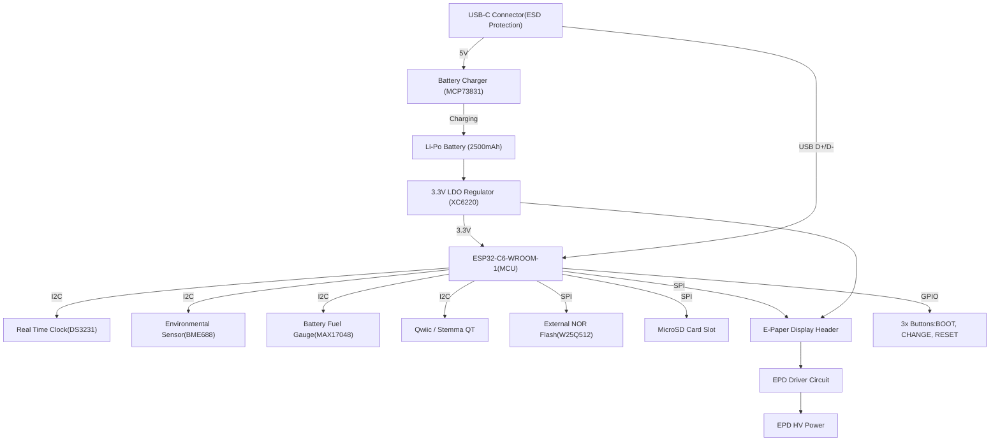

# OpenBook Reader

## Tabel Componente Principale (BOM)

| Parts | Device | Check Prices | Datasheet |
|-------|--------|--------------|-----------|
|R1, R2 .. | ESP32_WROVER_EAGLE-LTSPICE_RR0402 |https://componentsearchengine.com/part-view/R0402%201%25%20100%20K%20                   | https://componentsearchengine.com/part-view/R0402%201%25%20100%20K%20      |
| L1 | 744043680IND_4828-WE-TPC_WRE |  https://eu.mouser.com/ProductDetail/Wurth-Elektronik/744043680?qs=PGXP4M47uW6VkZq%252BkzjrHA%3D%3D               | https://eu.mouser.com/ProductDetail/Wurth-Elektronik/744043680?qs=PGXP4M47uW6VkZq%252BkzjrHA%3D%3D               |
| IC1 | BD5229G-TR |https://componentsearchengine.com/part-view/BD5229G-TR/ROHM%20Semiconductor                                    | https://componentsearchengine.com/part-view/BD5229G-TR/ROHM%20Semiconductor                                    |
| SENSOR2 | ESP32_WROVER_BME680_BME680 | https://www.snapeda.com/parts/BME680/Bosch/view-part/?welcome=home                                            | https://www.snapeda.com/parts/BME680/Bosch/view-part/?welcome=home                                            |
| SJ1              | SJ                                           | https://grabcad.com/library/solder-jumpers-1                                                                   | https://grabcad.com/library/solder-jumpers-1                                                                   |
| BOOT_BUTTON, CHANGE_BUTTON, RESET_BUTTON | BUTTON_CUSYOMV1 | https://industry.panasonic.com/global/en/products/control/switch/light-touch/number/evqpuj02k                  | https://industry.panasonic.com/global/en/products/control/switch/light-touch/number/evqpuj02k                  |
| C1, C2 .. | CPH3225A | https://www.snapeda.com/parts/CPH3225A/Seiko+Instruments/view-part/?ref=eda | - |
| U3 | DS3231SN# | https://www.snapeda.com/parts/DS3231SN%23/Analog+Devices/view-part/?ref=eda | [Datasheet](https://www.analog.com/media/en/technical-documentation/data-sheets/ds3231.pdf) |
| U2 | ESP32-C6-WROOM-1-N8 | https://www.snapeda.com/parts/ESP32-C6-WROOM-1-N8/Espressif+Systems/view-part/?ref=eda | - |
| PFMF.050.1 | ESP32C6_VARISTORCN1812| https://www.mouser.co.uk/ProductDetail/EPCOS-TDK/B72520T0350K062?qs=dEfas%2FXlABIszF52uu7vrg%3D%3D              | https://www.mouser.co.uk/ProductDetail/EPCOS-TDK/B72520T0350K062?qs=dEfas%2FXlABIszF52uu7vrg%3D%3D              |
| D2 | ESP32_WROVER_AVX---SD0805S020S1R0 | https://eu.mouser.com/ProductDetail/KYOCERA-AVX/SD0805S020S1R0?qs=jCA%252BPfw4LHbpkAoSnwrdjw%3D%3D              | http://datasheets.avx.com/schottky.pdf                                                                         |
| MCP73831 | ESP32_WROVER_SPARKFUN-IC-POWER_MCP73831 |  https://eu.mouser.com/ProductDetail/Microchip-Technology/MCP73831T-2ACI-OT?qs=yUQqVecv4qvbBQBGbHx0Mw%3D%3Dcf   |
| J1 | FH34SRJ-24S-0.5SH_99_ | https://componentsearchengine.com/part-view/XC6220A331MR-G/Torex                                              | https://componentsearchengine.com/part-view/XC6220A331MR-G/Torex                                              |
| U4 | MAX17048G+T10 | https://www.snapeda.com/parts/MAX17048G+T10/Analog+Devices/view-part/?ref=eda | - |
| D3, D4, D5 | MBR0530 | https://www.snapeda.com/parts/MBR0530/Onsemi/view-part/?ref=eda | - |
| D6, D8, D9, D10, D11, D12 | PGB1010603MR | https://www.snapeda.com/parts/PGB1010603MR/Littelfuse/view-part/?ref=eda | - |
| J3 | QWIIC_CONNECTORJS-1MM | - | - |
| J2 | SAMACSYS_PARTS_USB4110-GF-A |https://www.mouser.com/ProductDetail/GCT/USB4110-GF-A | https://gct.co/files/drawings/usb4110.pdf |
| D7 | ESP32_WROVER_AVX---SD0805S020S1R0 | - | [Datasheet](http://datasheets.avx.com/schottky.pdf) |
| BOOT_BUTTON | EVQPUJ02K | https://www.mouser.com/ProductDetail/Panasonic/EVQPUJ02K | [Datasheet](https://na.industrial.panasonic.com/file-download/21900) |
| Q3 | SI1308EDL-T1-GE3 | https://componentsearchengine.com/part-view/SI1308EDL-T1-GE3/Vishay                                           | https://componentsearchengine.com/part-view/SI1308EDL-T1-GE3/Vishay                                           |
| TP1, TP2, ..., TP17 | TPTP20R | - | - |
| D1 | USBLC6-2SC6Y |  https://www.snapeda.com/parts/USBLC6-2SC6Y/STMicroelectronics/view-part/?ref=eda                              | https://www.snapeda.com/parts/USBLC6-2SC6Y/STMicroelectronics/view-part/?ref=eda                              |
| U1 | W25Q512JVEIQ | https://www.snapeda.com/parts/W25Q512JVEIQ/Winbond+Electronics/view-part/?ref=eda | - |
| IC4 | XC6220A331MR-G | https://www.mouser.com/ProductDetail/Torex-Semiconductor/XC6220A331MR-G) | https://www.torexsemi.com/file/xc6220/XC6220.pdf |

## Descriere Detaliată a Funcționalității Hardware

### 1. Microcontroller – ESP32-C6
Dispozitivul folosește microcontroller-ul ESP32-C6-WROOM-1-N8, echipat cu un nucleu RISC-V pe 32 de biți, cu o frecvență maximă de 160 MHz.

- **Memorie:** 512 KB SRAM internă și flash extern de 8 MB (W25Q512JVEIQ).
- **Conectivitate:** Wi-Fi 6, Bluetooth 5 LE, interfață USB 2.0.
- **Periferice:** Suport SPI, I²C, UART și GPIO multipli.
- **Eficiență energetică:** Moduri sleep și deep sleep optimizate pentru utilizarea eficientă a bateriei.

### 2. Afișaj E-Paper
Afișaj E-Ink de 7.5” cu rezoluție de 800×480 pixeli

- **Interfață:** SPI 4-wire cu pini adiționali (CS, DC, RST, BUSY).
- **Consum:** Foarte redus în stare statică; crește doar temporar în timpul actualizării imaginii (aproximativ 15-25 mA).
- **Beneficii:** Imaginea este păstrată fără consum electric, ideal pentru dispozitive portabile tip e-reader.

### 3. Senzor Mediu – BME680
Senzor multifuncțional care măsoară temperatura, umiditatea, presiunea atmosferică și calitatea aerului (VOC/eCO₂).

- **Interfață:** I²C cu viteză de până la 400 kHz.
- **Consum:** Aproximativ 2.1µA în mod standby și câțiva mA la citiri active.
- **Avantaj principal:** Integrează multiple funcții de mediu într-un singur cip compact și eficient.

### 4. Management Energetic & Baterie
Sistemul energetic este bazat pe o baterie Li-Po de 3.7V și capacitate de 2500mAh, pentru autonomie extinsă.

- **Încărcare:** MCP73831, încărcare rapidă prin USB-C (maxim 1A).
- **Monitorizare:** MAX17048 comunică starea bateriei prin interfața I²C.
- **Regulator:** XC6220A331MR-G oferă tensiunea stabilă de 3.3V pentru componentele critice.

### 5. Interfață Utilizator – Butoane
Sunt incluse trei butoane tactile dedicate navigării, selecției și întoarcerii paginilor, fiecare conectat la GPIO cu debouncing hardware (rezistor și condensator) sau software.

### 6. Conector USB-C
- **Funcții principale:** Încărcarea acumulatorului, transferul de date (USB 2.0) și actualizarea firmware-ului. Utilizare de diode ESD (ex: USBLC6-2SC6Y) și rezistențe specifice pentru conformitate cu USB-C.

### 8. Slot MicroSD (112A-TAAR-R03)
- **Utilizare:** Stocare log-uri, cărți electronice și actualizări de firmware.
- **Interfață:** Compatibil cu SD (mod 1-bit sau 4-bit) sau SPI, configurabil în firmware.

### 8. Conector Qwiic (I²C)
Conector standardizat cu patru pini (VCC, GND, SDA, SCL) pentru extinderea rapidă a funcționalităților prin senzori sau module suplimentare.

### 9. RTC DS3231
- **Precizie:** Foarte ridicată.
- **Interfață:** Comunicare I²C integrată cu ceilalți senzori.

### 10. Memorie Flash Externă – W25Q512JVEIQ
- **Interfață:** Quad SPI pentru acces rapid la date.
- **Utilizare:** Stocarea aplicațiilor, imaginilor și fișierelor mari, inclusiv cărți electronice.

## Estimare Consum Energetic
- **Activ (Wi-Fi + refresh ecran):** Aproximativ 150 mA
- **Citire (ecran static):** Aproximativ 10 mA
- **Deep Sleep:** Sub 50 µA
- **Autonomie:** Aproximativ o săptămână, considerând un consum mediu de 10 mA (2500mAh ~250 ore utilizare).

## Estimare Consum de Energie
- **Activ (Wi-Fi + Refresh ecran)**: ~150mA  
- **Citire (ecran static)**: ~10mA  
- **Deep Sleep**: <50µA  
- **Autonomie estimată**: ~1 săptămână (la o utilizare medie de 10mA, o baterie de 2500mAh durează ~250 ore).

---

## Atribuirea Pinilor pe ESP32-C6

| Pin  | Funcție        | Componentă          | Descriere Utilizare           |
|-----:|:---------------|:--------------------|:------------------------------|
| GPIO0  | BOOT_BUTTON    | Buton               | Boot mode la pornire          |
| GPIO1  | RESET_BUTTON   | Buton               | Reset manual                  |
| GPIO2  | CHANGE_BUTTON  | Buton               | Navigare meniu                |
| GPIO3  | EPD_CS         | Display E-Paper     | Chip Select (SPI)             |
| GPIO4  | EPD_DC         | Display E-Paper     | Data/Command control          |
| GPIO5  | EPD_RST        | Display E-Paper     | Reset ecran                   |
| GPIO6  | EPD_BUSY       | Display E-Paper     | Semnal stare refresh          |
| GPIO7  | SPI_MOSI       | Display, Flash, SD  | Master Out Slave In (SPI)     |
| GPIO8  | SPI_MISO       | Display, Flash, SD  | Master In Slave Out (SPI)     |
| GPIO9  | SPI_SCK        | Display, Flash, SD  | Clock SPI                     |
| GPIO10 | FLASH_CS       | W25Q512JVEIQ        | Chip Select pentru Flash      |
| GPIO11 | SD_CS          | Micro SD (opțional) | Chip Select card SD           |
| GPIO12 | I2C_SDA        | BME680, MAX17048, DS3231 | Linie date I2C          |
| GPIO13 | I2C_SCL        | BME680, MAX17048, DS3231 | Linie clock I2C         |
| GPIO14 | CHG_LED        | LED încărcare       | Status încărcare              |
| GPIO15 | UART_TX        | Debugging           | TX serial                     |
| GPIO16 | UART_RX        | Debugging           | RX serial                     |
| GPIO17 | USB_D+         | USB-C               | Linie date USB +              |
| GPIO18 | USB_D-         | USB-C               | Linie date USB –              |

---

## Concluzii
Prin acest README, aveți la dispoziție elementele cheie ale construcției hardware pentru e-reader-ul **OpenBook**: modulul ESP32-C6, ecranul e-paper, senzorii, alimentarea și circuitele de încărcare. Fișierul CSV atașat oferă o listă detaliată a componentelor (BOM).